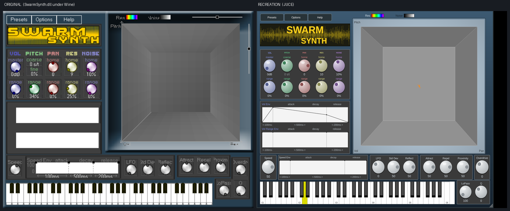

# smarmsynth — reverse-engineering and re-creating SwarmSynth

Anarchy Sound Software's **SwarmSynth** (2003) is a swarm of oscillators that
move through a parameter space under attraction, repulsion and reflection. It is
deliberately raw. This repository rebuilds it with modern tools, in three parts:

1. **A VST2 host** (`vsthost32.exe`) that runs the 32-bit Windows original under
   Wine — live with audio and MIDI, or headless and deterministic.
2. **A measurement rig** (`analysis/`) that recovers the synthesis model from the
   plugin's own output and its own visualiser — see
   [FINDINGS.md](analysis/FINDINGS.md).
3. **A JUCE plugin** (`juce/`) built from what that measures, with an A/B
   harness that scores it against the original.

> **You need your own copy of `SwarmSynth.dll`.** SwarmSynth is a product of
> Anarchy Sound Software and is not redistributed here. Drop the DLL in the
> repository root and everything below works.
>
> Nothing here is derived from the plugin's code. `vst2.h` is a clean-room
> declaration of the published VST2 ABI, and the synthesis model in
> [`analysis/FINDINGS.md`](analysis/FINDINGS.md) was recovered by measuring the
> plugin's audio output and watching its own visualiser — no disassembly.

`SwarmSynth.dll` is a 32-bit Windows VST2 plugin (PE32 i386, build stamp Feb
2003). `vsthost32.exe` is a small purpose-built VST2 host, cross-compiled to
32-bit Windows and run under Wine, that loads it, plays it live, and renders it
offline.

## Quick start

```sh
./run.sh                       # GUI + live audio + MIDI in
./run.sh --info                # dump id, flags, 32 programs, all 101 params
./run.sh --render out.wav --note 48 --note 55 --note 60 --len 2 --tail 2
```

`run.sh` builds if needed and sets `WINEDEBUG=-all`. Set `PLUGIN=other.dll` to
host something else — nothing in the host is SwarmSynth-specific.

In the GUI window: `z s x d c v g b h n j m` = C..B, `q 2 w 3 e r 5 t 6 y 7 u` =
an octave up, up/down arrows change octave, space = all notes off, esc = quit.
If the plugin's own GUI has keyboard focus, click the host window's title bar
first. Any ALSA MIDI source works too — the host opens every MIDI input it can.

## What we learned about the plugin

```
name        SwarmSynth      vendor  AnarchySoundSoftware
uniqueID    0x03430097      VST 2   0 in / 2 out, synth
flags       hasEditor canReplacing programChunks isSynth
editor      680 x 536
programs    32              params  101
entry point exported as `main` (pre-2.4 convention), not `VSTPluginMain`
canDo       receiveVstEvents, receiveVstMidiEvent, receiveVstTimeInfo
```

The 101 parameters read as a clean architecture map:

| range   | what                                                             |
|---------|------------------------------------------------------------------|
| 0–3     | Volume, Pan, Resonance, Noise — the five per-voice "home" values  |
| 4–8     | Vol/Pitch/Pan/Res/Noise **Var.** — spread of the swarm            |
| 9–15    | Speed, Speed LFO, Std. Dev., Reflection, Attract, Repel, Proximity — the flocking model |
| 16–18   | Lowpass, Q, Overdrive                                            |
| 19–21   | Oscillators (8), Portamento, Seed                                |
| 22–26   | Volume envelope (AtkTm/AtkLv/DecTm/DecLv/RelTm)                  |
| 27–58   | Pitch / Pan / Res / Noise envelopes, each with Env Rg + Ini/Atk/Dec/Rel |
| 59–93   | …the *variance* of each of those, as its own envelope            |
| 94–100  | Speed envelope                                                   |

So: a swarm of N oscillators (default 8), each with position/velocity in a
parameter space driven by attract/repel/proximity/reflection forces, where every
per-voice quantity has both a centre value and a variance, and both are
independently enveloped. That is the thing to re-create.

`--info` prints the live values; it is the authoritative version of the table
above.

## Recreating it

Two things came out of hosting the original: a measurement rig, and a JUCE
plugin being driven by what it measures.

```sh
./run.sh --map-params 33 > analysis/data/param_map.csv   # exact parameter laws
./run.sh --dump-chunk patch.chunk                        # its state, raw
analysis/chunkdiff.sh                                    # map chunk offsets
analysis/capture_swarm.sh --param 5=0.4 --param 9=0.6    # watch the swarm move
analysis/gui_run.sh out/ "dclick:150,285; dump"          # script the original's editor
python3 analysis/build_spec.py                           # regenerate the C++ spec
```

`analysis/FINDINGS.md` is the write-up: the 5-dimensional particle box, the
formant-grain oscillator (`f_res = f0 * (1 + 46*Res^3)`), the exact parameter
quantiser and display laws, and the 1908-byte preset format with 100 of 101
parameters located.

### The JUCE plugin

```sh
cd juce && cmake -B build -DCMAKE_BUILD_TYPE=Release && cmake --build build -j
```

Builds a VST3 and a standalone. `juce/Source/SwarmParams.h` is **generated** from
the measurements by `analysis/build_spec.py`, so the parameter table, the
quantisers and the preset offsets cannot drift from what was measured.
`juce/Source/SwarmPreset.h` loads original SwarmSynth patches.

### The GUI



The editor is laid out in the original's own 680 x 536 units and scaled as a
whole, so the proportions hold at any window size. `analysis/data/ref_native.png`
is the reference capture the rectangles in `PluginEditor.cpp` were measured off
(the plugin's editor is exactly 2.5x on this display, so the capture rescales to
native without guesswork).

Working parts: the five parameter columns with their home and range knobs, the
column selector, both envelope editors, the Speed envelope, all the motion and
filter knobs, the on-screen keyboard, and the 3D swarm view driven by live
particle positions from the engine.

The envelope panels are real breakpoint editors, with the original's own verbs:
double-click empty plot to add a point, drag a point to move it, right-click to
delete. Clicking any knob in a column brings that dimension's envelope pair up,
as the original does. Extra breakpoints live in the plugin state rather than the
parameter list, which is the same split the original makes.

`cmake --build build --target test_env && ./build/test_env` checks the envelope
model headlessly -- insert, delete, length preservation and state round-trip --
so that behaviour is verified without driving a GUI.

Two things the original has that this does not yet: the zoom and rotate sliders
on the 3D panel, and the pitch **fine** control. Pitch coarse and fine are worth
a note -- they exist in the original's state chunk at `0x1c` and `0x20` but are
**not** exposed as VST parameters, so that knob is inert here rather than
pretending to be wired to something.

Building the GUI paid for itself immediately: rendering the envelope panels
showed the segment durations reading 224 ms where the original says 500 ms,
which traced back to a real bug in the preset importer. Envelope times are
stored in the chunk in **seconds**, not as normalised values -- the default
patch holds 0.1 / 0.5 / 0.2 for controls that read 100 / 500 / 200 ms. Every
imported patch would have had wrong envelope times.

### Running the standalone

```sh
./run-standalone.sh
```

The Options dialog lists around sixty outputs because ALSA exposes every PCM on
the system -- raw `hw:` devices, rate converters, the lot. Only a handful are
useful. The launcher picks one for you and, more importantly, sets the rate and
buffer: **left to itself JUCE opens at 8000 Hz with a 16-frame buffer**, which
sounds wrong and glitches.

If you would rather choose in the dialog, the entries worth picking are:

| pick this | it is |
|---|---|
| `PulseAudio Sound Server` | routes through PipeWire to your normal output |
| `Default ALSA Output (currently PipeWire Media Server)` | same, via ALSA's default |
| `PipeWire Sound Server` | same, direct |

Then set the sample rate to 44100 or 48000 and the buffer to 256 or 512. That
choice persists, and `run-standalone.sh` leaves an existing setting alone.

One trap worth recording: JUCE matches the saved device against the ALSA
*description*, not the PCM id. Writing `pulse` into the settings matches nothing
and it silently falls back to that 8000 Hz default. The name has to be
`PulseAudio Sound Server` -- the description line `aplay -L` prints under the id.
Override with `DEVICE="PipeWire Sound Server" RATE=44100 ./run-standalone.sh`.

MIDI inputs are enabled in the same dialog and persist the same way.

`SWARM_DEBUG=1` makes the plugin print the rate and buffer it was actually
given, plus envelope edits -- which is how the 8000 Hz default was found.

### Patches

The original's 45 factory patches live inside its own resources rather than as
files. They are checked in under `presets/original/` — SwarmSynth was released
as freeware in 2012; see the [NOTICE](presets/original/NOTICE.md). They are also
regenerable from a copy of the plugin:

```sh
analysis/extract_presets.sh          # -> presets/original/*.swarmpatch
python3 analysis/preset_ab.py        # score the recreation on all of them
```

The recreation's **Presets** button lists whatever it finds, in
`$SWARM_PRESETS`, a `presets/` directory next to the binary, or under your
application-data and documents directories.

The same patches double as the DSP benchmark. Synthetic one-parameter tests
only go so far; 45 real patches are what the synth actually sounds like.
Current standing: **median 20.8 dB, best 6.6 (Dischord), worst 99.6
(Pizzicato)**. The plucked and brassy patches are the worst, which points at the
attack transient rather than the swarm.

`analysis/preset_stats.py` reports what the factory patches actually use, and
the Anarchy randomiser now samples from that distribution instead of uniformly
over the parameter space.

### The Anarchy button

The original hides a patch randomiser under Options -> `<anarchy button>`. The
recreation puts it in the top row where you can reach it, and it is also
available offline:

```sh
./swarmrender out.wav --anarchy 12345 --note 48 --len 1.5
python3 analysis/anarchy_survey.py 64      # how good are random patches?
```

A randomiser is only worth pressing if most presses give something you can
hear, so that is measured rather than assumed: over 64 seeds, 98% are audible,
100% move, and the median centroid wobble is 1.6 semitones. What the original
randomises internally was not recovered -- this is a designed distribution,
shaped per parameter, not a reproduction of that one.

### The loop

`swarmrender` is the new engine behind the same command line as
`vsthost32 --render`, so both can be rendered under identical conditions:

```sh
g++ -O2 -std=c++17 juce/tools/render_cli.cpp -o swarmrender
python3 -c "import sys;sys.path.insert(0,'analysis');import ab,probe;
ab.compare({probe.P['resonance']:0.5}, label='res 50%')"
```

This is what decides modelling questions. The grain window is a worked example:
a time-domain plot said the burst was unwindowed, the A/B said a raised cosine
scores 14.8 dB against 24.6 dB. The metric won.

## Host options

```
--info                 id, flags, programs, all parameters, then exit
--list-midi            list MIDI input devices and exit
--midi <n>             open only MIDI input device n (default: all)
--no-midi              open no MIDI input
--program <n>          select program n
--fxp <file>           load an .fxp/.fxb (FxCk raw params, FPCh/FBCh chunks)
--param <i>=<v>        set parameter i to v in 0..1, repeatable
--sr <hz>              sample rate (default 44100)
--block <n>            block size in frames (default 512)
--buffers <n>          output buffers (default 4, so ~46 ms latency)
--render <out.wav>     offline render to 32-bit float WAV, no GUI
  --note <n>             note, repeatable for chords (default 60)
  --vel <v>              velocity (default 100)
  --len <sec>            note hold time (default 2)
  --tail <sec>           time rendered after note off (default 2)
--verbose              log audioMaster calls the host doesn't handle
```

`--render` is the one that matters for re-creation work: it is deterministic and
headless, so a recreation can be A/B'd against the original per patch, per note.

## Files

| file          | what                                                           |
|---------------|----------------------------------------------------------------|
| `vst2.h`      | minimal clean-room VST 2.4 ABI — struct layout and opcodes only, no SDK code |
| `host.cpp`    | the host: loader, audioMaster, WinMM audio out, WinMM MIDI in, editor window, offline render, WAV writer |
| `Makefile`    | cross-compile with `i686-w64-mingw32-g++`                      |
| `run.sh`      | build-if-needed + `wine vsthost32.exe`                         |
| `FEATURES.md` | running list of ideas and open questions                       |

## Build environment

Needs a 32-bit mingw-w64 C++ cross-compiler and a Wine with 32-bit support.
Wine 10.0 with `wine32:i386` was already present; it runs the plugin in
experimental WoW64 mode without complaint.

The cross-compiler is **not** installed system-wide (no passwordless sudo here).
It was unpacked from `.deb`s into `~/.local/opt/mingw-i686`, which is where the
`Makefile` looks by default. To use a system toolchain instead:

```sh
sudo apt install g++-mingw-w64-i686
make MINGW_PREFIX=/usr/bin
```

To recreate the local toolchain from scratch:

```sh
mkdir -p /tmp/mw && cd /tmp/mw
apt-get download binutils-mingw-w64-base binutils-mingw-w64-i686 \
  g++-mingw-w64-i686 g++-mingw-w64-i686-win32 gcc-mingw-w64-base \
  gcc-mingw-w64-i686-win32 gcc-mingw-w64-i686-win32-runtime \
  mingw-w64-common mingw-w64-i686-dev
for d in *.deb; do dpkg-deb -x "$d" ~/.local/opt/mingw-i686; done
```

## Notes and rough edges

- The plugin's Presets menu points at `c:\swarmsynth\presets\`; that directory
  has been created inside the default Wine prefix (`~/.wine`).
- On a fresh editor open the two envelope panels render blank. The host now
  rewrites every parameter with its existing value once the window is up, which
  is enough to paint the knobs, but those two panels only repaint on a real
  mouse event — one knob move and they appear. That is the plugin's behaviour,
  not the host's.
- Audio goes out via WinMM → Wine → PipeWire/PulseAudio. Verified end to end:
  a note sent to ALSA `Midi Through` came back out of the default sink.
- Wine exposes ALSA MIDI ports as WinMM devices; `Midi Through Port-0` works,
  and a hardware controller shows up the same way. The PipeWire pseudo-ports
  fail to open and are skipped silently.
- All plugin calls are serialised behind one critical section, because a 2003
  plugin is not thread-safe and the GUI and audio threads both talk to it. GUI
  interaction can therefore cost an audio block; raise `--buffers` if it
  crackles.
- `--fxp` handles the standard fx container. SwarmSynth sets `programChunks`, so
  its real state lives in an opaque chunk (`FPCh`/`FBCh`), which we pass through
  verbatim without understanding it.
- Only the first two plugin outputs are used.
